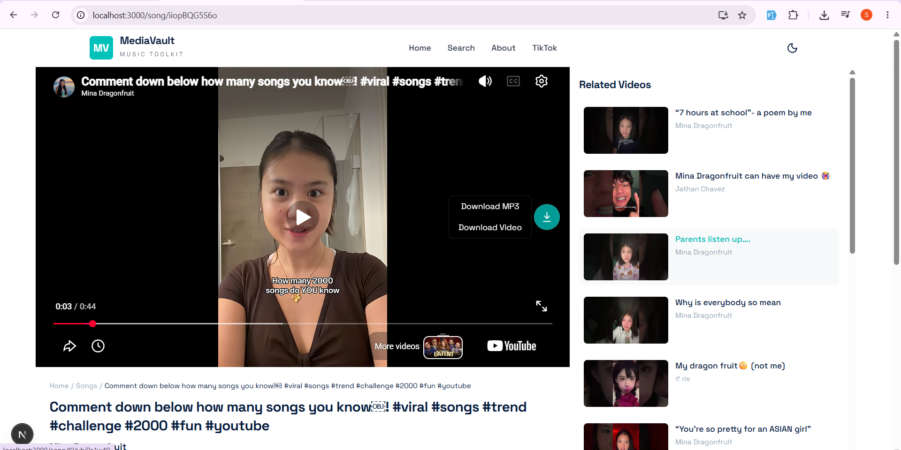

# UX Improvements – MediaVault

## Overview

This document describes the UX improvement made to the MediaVault song page to make the download functionality easier to discover and access.

## Issue: Download Action Accessibility

### Problem

The song page already provided Download MP3 and Download Video buttons below the video. However, users had to scroll down to find these actions.

The video itself also contains YouTube controls, which can make it less obvious that MediaVault provides its own download functionality.

This created an opportunity to make the download action more visible and accessible directly from the video section.

### Solution

A dedicated download button was added to the right side of the video section.

When the user clicks the download icon, a small menu appears with two options:

- Download MP3
- Download Video

The new menu reuses the existing download functionality, so the underlying download flow was not changed.

The existing download buttons below the video were also kept unchanged.

### UI Details

- Added a dedicated download icon over the video.
- Positioned the icon on the right side and vertically centered.
- Used MediaVault's teal accent color to match the existing UI.
- Added a subtle bounce animation when the page loads to draw attention to the download action.
- Added hover feedback for better interaction.
- Added `aria-label` and `title` for accessibility.
- Clicking the download icon opens the MP3 and Video download options.

### What I Learned

This improvement helped me understand the importance of making frequently used actions easy to discover without changing the existing functionality.

I also learned how to:

- Add interactive UI elements to an existing component.
- Reuse existing functions instead of duplicating functionality.
- Create a contextual download menu.
- Use CSS animations to provide subtle visual feedback.
- Improve accessibility with appropriate labels and titles.

## Screenshots

### Before

The existing download actions were available below the video, but there was no direct download action associated with the video section.

### After

A download icon is now available directly on the video section. Clicking it displays the MP3 and Video download options.