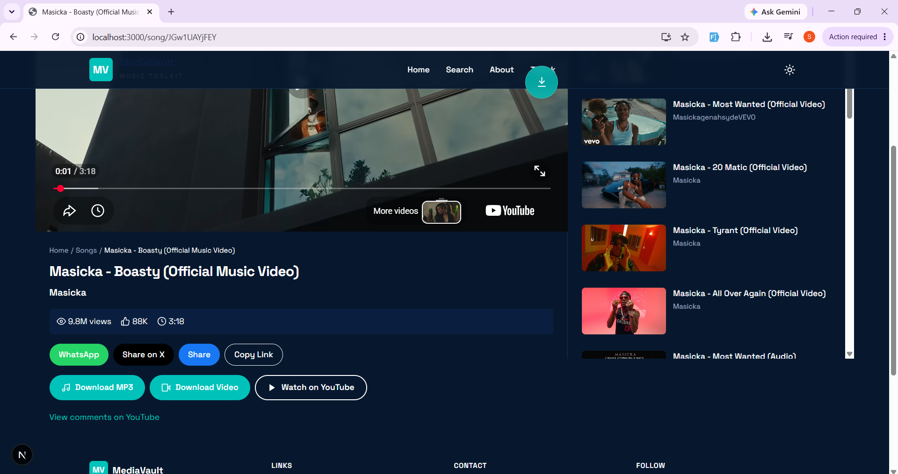
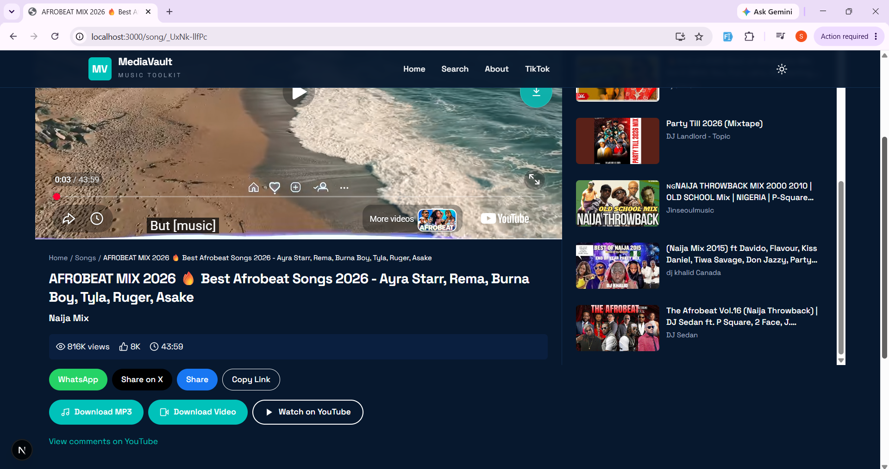

# MediaVault UX Improvements

## Overview

This document describes the UX investigation and improvements made to the MediaVault song page as part of the HERMAN evaluation task.

## Issue 1: Download Action Accessibility

### Investigation

I reviewed the video and download interaction on the song page.

The video player contains a YouTube action, which opens the corresponding YouTube video when selected. This behaviour is intentional and working as expected.

The song page also provides dedicated download actions for MP3 and video formats below the song information.

Since the existing YouTube action and download functionality were working as intended, no unnecessary functional change was made to the existing download flow.

However, the existing download actions were not immediately visible from the video section. This created an opportunity to make the download functionality easier to discover.

### Solution

A dedicated download button was added to the right side of the video section.

When the user clicks the download icon, a small menu appears with two options:

- Download MP3
- Download Video

The new menu reuses the existing download functionality, so the underlying download flow was not changed.

The existing download buttons below the video were also kept unchanged.

### UI Details

- Added a dedicated download icon over the video.
- Positioned the icon on the right side and vertically centered.
- Used MediaVault's teal accent color to match the existing UI.
- Added a subtle bounce animation when the page loads to draw attention to the download action.
- Added hover feedback for better interaction.
- Added `aria-label` and `title` for accessibility.
- Clicking the download icon displays the MP3 and Video download options.

### Screenshots

#### Before

The existing download actions were available below the video, but there was no direct download action associated with the video section.

#### After

A download icon is now available directly on the video section. Clicking it displays the MP3 and Video download options.

---

## Issue 2: Scrolling Experience

### Problem

On desktop screens, the video section remained sticky while the content below it was independently scrollable.

This caused the video and the rest of the song information to feel disconnected. While scrolling, the content could move underneath the video area, causing parts of the content to become hidden.

### Root Cause

The left content column used:

- `lg:max-h-screen`
- `lg:overflow-y-auto`

This created a separate scrolling container.

The video wrapper also used:

- `lg:sticky`
- `lg:top-16`

This caused the video to remain fixed while the surrounding content was being scrolled.

### Solution

The sticky positioning was removed from the video wrapper.

The viewport height restriction and independent vertical scrolling were also removed from the left content column.

The layout now allows the video and the content below it to remain in the normal document flow.

### Result

The song page now provides a more natural scrolling experience:

- The video scrolls together with the page content.
- The song information is no longer hidden behind the video.
- The separate scrolling behaviour of the left content area has been removed.
- The overall page feels more connected and consistent.

### Screenshots

#### Before

The video remained sticky while the content below moved underneath it.

#### After

The video and page content now scroll naturally together.

---

## Additional UX Fix: Download Button and Sticky Navbar

### Problem

While scrolling the song page, the newly added download button could appear above the sticky navigation bar because of its z-index.

### Solution

The download button's stacking order was adjusted so that the sticky navigation remains above the download button while scrolling.

### Result

The download button remains accessible while respecting the visual hierarchy of the sticky navigation.

### Screenshots

#### Before

#### After

---

## What I Learned

This task helped me better understand how UI implementation decisions can affect the overall user experience.

I learned how to:

- Make frequently used actions easier to discover without changing existing functionality.
- Add interactive UI elements to an existing component.
- Reuse existing functions instead of duplicating functionality.
- Create a contextual download menu.
- Use CSS animations to provide subtle visual feedback.
- Improve accessibility with appropriate labels and titles.
- Understand how `sticky`, `max-h-screen`, and `overflow-y-auto` can create independent scrolling behaviour.
- Identify the root cause of a UX issue before implementing a fix.
- Manage stacking order and z-index when combining fixed or sticky UI elements.
- Verify UI changes locally after implementation.

---
## Issue 3: Dark Mode UI Refinements

### Investigation

The MediaVault project already had an existing dark mode implementation, including the theme toggle, theme persistence, and system preference handling.

During testing of the website in dark mode, I reviewed the existing UI to identify elements that did not have sufficient contrast or appropriate dark-mode styling.

Two UI issues were identified on the homepage:

- The MediaVault logo text became difficult to see against the dark navigation background.
- The Trending Channel cards retained a light background while their text changed to a light color, resulting in poor contrast.

### Solution

The existing dark mode implementation was kept unchanged.

Instead, dark-mode Tailwind utility classes were added only to the affected components.

#### Logo

The logo styling was updated to provide better contrast in dark mode:

- `MediaVault` uses `dark:text-white`.
- `Music Toolkit` uses `dark:text-gray-medium`.

The existing logo structure and branding were not changed.

#### Trending Channel Cards

The Trending Channel cards were given a dark-mode background using a component-level `dark:bg-navy-light` utility.

The shared `card-base` class was intentionally left unchanged because it is reused across different parts of the application and some pages already have their own page-specific dark-mode styling.

This avoids unintentionally changing the appearance of existing cards elsewhere in the application.

### Result

The affected homepage elements now display correctly in both light and dark modes:

- Logo text remains clearly visible in the dark navigation bar.
- Trending Channel cards have an appropriate dark surface.
- Card text has sufficient contrast against the dark background.
- Existing dark-mode behaviour and theme logic remain unchanged.

### What I Learned

This refinement helped me understand the importance of working with an existing design system without unnecessarily changing shared functionality.

I learned to:

- Inspect existing dark-mode implementation before adding new logic.
- Identify UI-specific contrast issues during visual testing.
- Use component-level Tailwind `dark:` utilities when a shared class should remain unchanged.
- Avoid modifying reusable global styles when the required change only affects specific components.
- Preserve existing functionality while making targeted UI improvements.

### Screenshots

#### Before

#### After

## Issue 4: Download Button and Sticky Navbar Overlap

### Problem

After adding the floating download button to the song page, an additional UI issue was noticed while testing the page during scrolling.

When the user scrolled down, the download button could appear above the sticky navigation bar.

This created an incorrect visual stacking order between the floating download action and the navigation.

### Root Cause

The download button and the sticky navigation bar were using overlapping z-index levels.

The navigation header uses a higher stacking level because it is intended to remain above page content while scrolling.

The download button was initially using the same z-index level, which allowed it to overlap the navigation.

### Solution

The z-index of the download button was reduced so that the sticky navigation remains above it during scrolling.

No changes were made to the button's position, functionality, styling, or download behaviour.

### Result

The download button now remains accessible while respecting the visual hierarchy of the sticky navigation.

The navigation stays above the download button when the user scrolls through the song page.

### Screenshots

#### Before

#### After

